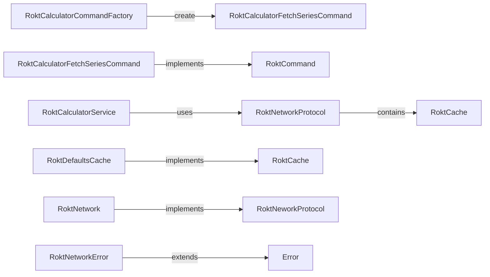
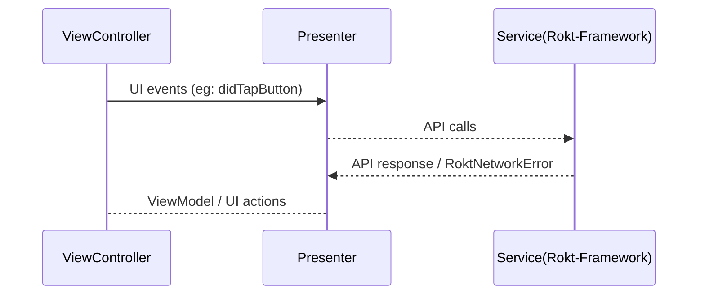
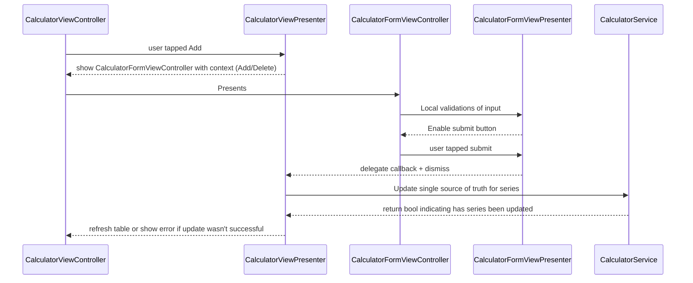

# Rokt App

Hi! This is a demo workspace project to demonstrate separation of network layer and application logics. I have implemented the network layer - **rokt-framework** purely from scratch without any dependencies. In the same workspace, the app project - **rokt-app** will demonstrate usage of framework. **rokt-app** uses MVP (Model-View-Presenter) pattern.

To further assist integration testing, I have developed a suite of test data APIs through firebase functions. That project is called **rokt-test-api**, which I will also include details of the project in this document. 

### Xuwei

# Recommened setup for development

 - Xcode 13.1
 - OSX Big Sur
 - **rokt-app** deployment target is set to iOS13
 - **rokt-framework** deployment target is set to iOS12
 - **git repo** https://github.com/xuwei/rokt - "git clone git@github.com:xuwei/rokt.git"

## Steps to run project after checkout from git

 1. Open a terminal/SourceTree
 2. check out the repo
 3. **cd rokt** into the project root folder
 4. "**open .**" if you are in terminal, open in finder if you checkout through SourceTree
 5. double click on workspace file - [screenshot reference](https://firebasestorage.googleapis.com/v0/b/rokt-test-api.appspot.com/o/images/readme-screenshot-01.png?alt=media&token=5bf66dd0-da79-49da-a8e1-9fa499f47f50)
 6. two project should show up, one is call **rokt-app** and the other is **rokt-framework**

## Running rokt-app

 1. Ensure that you have selected **rokt-app** scheme, and simulator version iOS13 or above
 2. Ensure you have internet connection
 3. Simply click the run button on Xcode
 
 Note: app also supports **DarkMode**

## Running tests on rokt-framework

 1. Ensure that you have selected **rokt-framework** scheme, and simulator version iOS12 or above
 2. On Xcode menu, go to **Product->Test** or "**Cmd + u**" to run all unit/integration tests
 3. For docC documentation of the code base, go to **Product->Build Documentation**, this will trigger and popup the docC documentation for the code base. 

## rokt-test-api

 - Developers don't need to checkout and setup firebase emulator locally to have integration tests working. As rokt-test-api is deployed and live already.
 - Link to the API dashboard - https://console.firebase.google.com/project/rokt-test-api/functions/list
 - **git repo** https://github.com/xuwei/rokt-test-api - "git clone git@github.com:xuwei/rokt-test-api.git"

## Notes for Developer

I would like to briefly describe the architectural design of both project below. 

## rokt-framewok

Some key relationships:

 - **RoktNetwork** was abstracts the use of URLSession
 - **RoktCache** is a protocol for cache classes.
 - **RoktDefaultsCache** uses UserDefaults for storage, however, the implementation can be different depending on requirement.

## rokt-app

### flow on rokt-app when doing API call 

### flow on rokt-app when "Removing number"

## Further contact

For any further enquiry, feel free to drop me an email - email.xuwei@gmail.com
Xuwei

